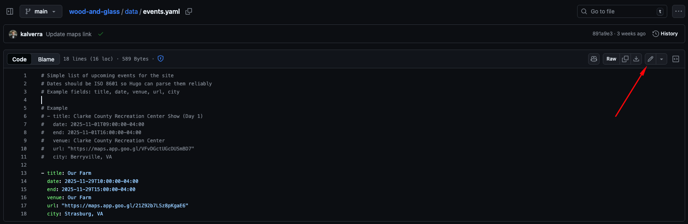

# Updating Events

How to update events on the site.

## Simple

Use GitHub's UI to make and commit changes.

1. Go to the [data/events.yaml](./data/events.yaml) file.
2. Click the edit button 
3. Add/edit/delete info as necessary, Propose Changes
4. Send Admin (Adam) a link to the PR.

## Advanced

Use your local machine and git to make the changes. Read the [intro to git](https://docs.github.com/en/get-started/using-git/about-git) to get a good overview of how it works.

1. [Install Git](https://git-scm.com/install/windows)
2. [Install Hugo](https://gohugo.io/installation/)
3. [Clone the wood-and-glass repo](https://docs.github.com/en/repositories/creating-and-managing-repositories/cloning-a-repository)
4. [Create a new branch](https://git-scm.com/book/en/v2/Git-Branching-Basic-Branching-and-Merging)
5. Make the changes to the [data/events.yaml](./data/events.yaml) file.
6. Preview the changes
```sh
hugo server -D
```
7. [Commit and push your branch](https://docs.github.com/en/get-started/using-git/pushing-commits-to-a-remote-repository)
8. Create a PR to `main` branch with your changes.
